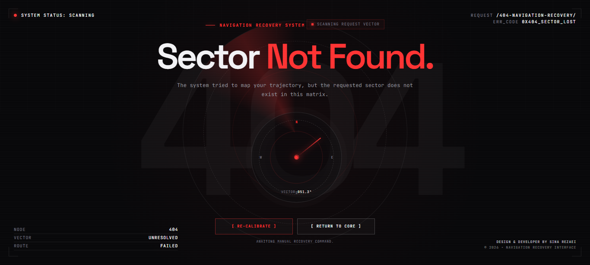

# SECTOR LOST

### Interactive 404 Navigation Recovery System

A cybernetic 404 experience where a lost route becomes an interactive navigation recovery system.

Instead of treating a `404` page as a static error message, **Sector Lost** turns the missing route into a small system with its own state, navigation logic, visual feedback, and recovery sequence.

---

## Concept

A missing page is not the end of the navigation.

The system detects the failed route, analyzes the navigation state, attempts to recalibrate the request vector, and provides a verified route back to the core.

```text
REQUEST
   ↓
SCANNING
   ↓
SECTOR LOST
   ↓
RECALIBRATING
   ↓
ROUTE VERIFIED
   ↓
RETURN TO CORE
```

The interface is designed around the idea that an error state can still communicate **behavior, direction, and recovery** rather than simply displaying an error code.

---

## Features

* Interactive navigation compass
* Mouse-driven vector tracking
* Smooth compass needle movement
* Dynamic request path detection
* Navigation recovery sequence
* System state transitions
* Route recalibration interaction
* Animated scanner and radar layers
* Cybernetic grid interface
* Responsive layout
* Reduced-motion support
* Zero external JavaScript frameworks
* Portfolio-ready creator signature

---

## System States

The interface is built around a small navigation state model:

```text
SCANNING
   ↓
SECTOR LOST
   ↓
RECALIBRATING
   ↓
ADJACENT SECTORS SCANNED
   ↓
PARENT NODE IDENTIFIED
   ↓
ROUTE VERIFIED
```

Each state changes the interface feedback instead of leaving the user on a static error screen.

---

## Interaction

Move the pointer around the interface to influence the navigation compass.

The compass calculates the pointer's relative direction and continuously updates the displayed vector.

The **RE-CALIBRATE** action starts the recovery sequence:

```text
Rebuilding Request Vector
        ↓
Scanning Adjacent Sectors
        ↓
Parent Node Identified
        ↓
Route Verified
```

Once the route is verified, the return navigation becomes active.

---

## Visual Direction

The visual language combines:

* Dark system interfaces
* Navigation instruments
* Cybernetic dashboards
* Minimal editorial typography
* Radar/scanner graphics
* Error-state interfaces
* Technical system feedback

The design intentionally avoids turning the page into a conventional dashboard. The interface stays focused on one task:

**finding the way back.**

---

## Tech Stack

### Current Prototype

* HTML5
* CSS3
* Vanilla JavaScript
* Google Fonts

  * Space Grotesk
  * JetBrains Mono

No framework or animation library is required for the current prototype.

---

## Project Structure

```text
sector-lost/
│
├── index.html
└── README.md
```

The current version is intentionally kept lightweight as a standalone HTML prototype.

---

## Development Roadmap

The HTML version is the first prototype of the interface.

Future versions can evolve the system into a component-based application:

```text
HTML Prototype
      ↓
React Component System
      ↓
Next.js 404 Architecture
      ↓
Advanced Navigation System
```

Potential future improvements include:

* React component architecture
* Next.js dynamic route detection
* Route-aware recovery logic
* Advanced page transitions
* GSAP-based motion system
* WebGL / Canvas visual effects
* Magnetic cursor system
* Real route suggestions
* Navigation history analysis
* Advanced state machine
* Sound design
* Accessibility improvements
* Reusable 404 system components

---

## Why This Project Exists

Most 404 pages communicate only one thing:

> This page does not exist.

**Sector Lost** explores a different approach.

A failed route becomes an interaction.

A missing page becomes a system state.

An error becomes a navigation problem.

And the interface responds by trying to solve it.

---
### Demo

**Live Demo:**  
https://starvixhub.github.io/404-Navigation-Recovery/

**CodePen:**  
https://codepen.io/editor/sinarezaei/pen/01a10bdb-84f0-7c22-8eb6-950333aa7da8
---

## Design & Development

**DESIGN & DEVELOPER BY SINA REZAEI**

© 2026 Sina Rezaei

---

## License

This project is created as a personal design and development experiment.

Feel free to study the implementation and use the ideas as inspiration. Please do not present the original design or implementation as your own work.
